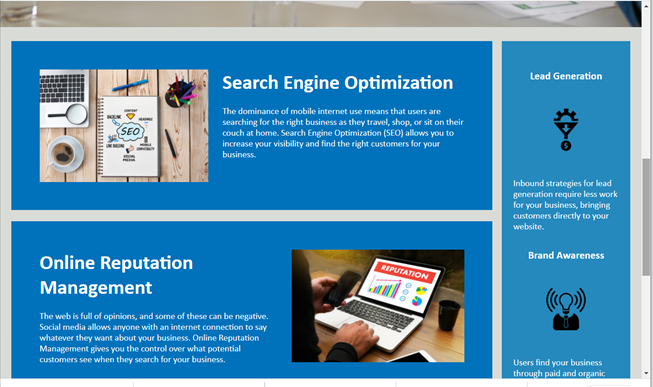
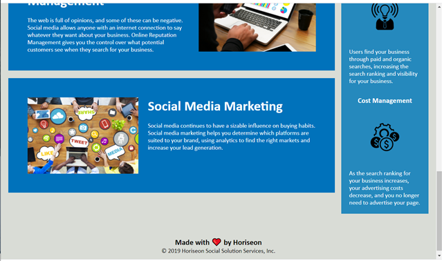
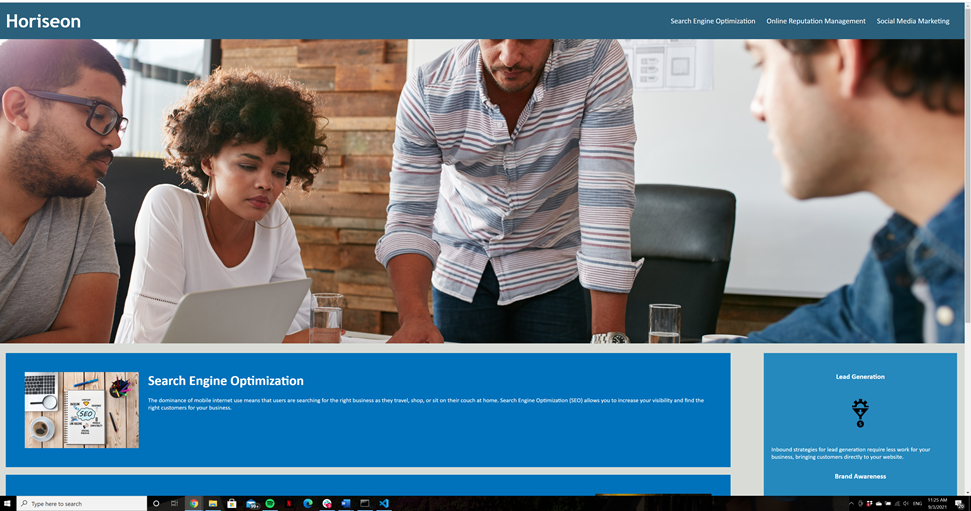
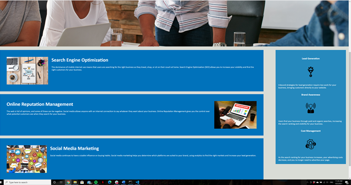

# 01 Homework Activity - Marketing Agency

## CSS
This tasks mainly involved consolidating a lot of the CSS file. There were excess amounts of IDs used, each with the same formating. These were consolidated into single IDs or Classes. 

Comments were added to CSS.

## HTML
In the HTML, there was again excessive tagging of Class and ID selectors, I removed as many double ups as possible. Many of the elements had both Class and ID selectors. 

The meta title was updated, along with responsive device design added.

Link tags were updated to take the user to the corresponding content in the HTML body. 

## Screenshots

These first 3 screen shots are from my smaller latop screen. 

These last 2 screen shots are from my wider computer monitor. Note how the design is responsive for screen size. 

## Link to deploy application

Please click on the following link to access website

[Marketing Agency Website](https://b3nj1e.github.io/01-Homework-Marketing-Agency/)